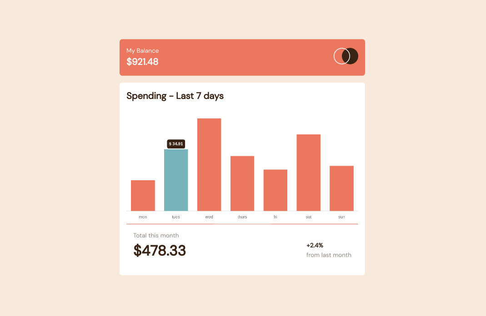
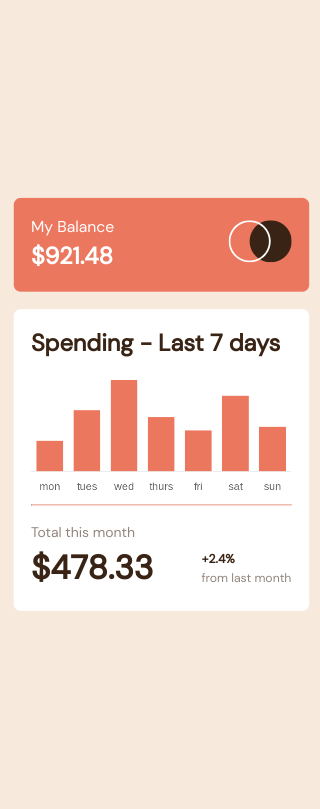
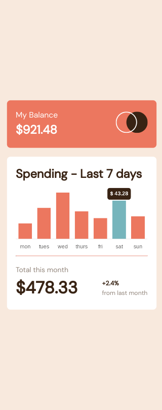

# Frontend Mentor - Expenses chart component solution

This is a solution to the [Expenses chart component challenge on Frontend Mentor](https://www.frontendmentor.io/challenges/expenses-chart-component-e7yJBUdjwt). Frontend Mentor challenges help you improve your coding skills by building realistic projects. 

## Table of contents

- [Overview](#overview)
  - [The challenge](#the-challenge)
  - [Screenshot](#screenshot)
  - [Links](#links)
- [My process](#my-process)
  - [Built with](#built-with)
  - [What I learned](#what-i-learned)
  - [Useful resources](#useful-resources)

## Overview

### The challenge

Users should be able to:

- View the bar chart and hover over the individual bars to see the correct amounts for each day
- See the current day’s bar highlighted in a different colour to the other bars
- View the optimal layout for the content depending on their device’s screen size
- See hover states for all interactive elements on the page
- **Bonus**: Use the JSON data file provided to dynamically size the bars on the chart

### Screenshot

### Links

- Live Site URL: [Github Pages](https://jdegand.github.io/expenses-chart-component)

## My process

### Built with

- Semantic HTML5 markup
- CSS custom properties
- Flexbox
- [ChartJS](https://www.chartjs.org)

### What I learned

This project was a nice opporunity to use Chartjs. ChartJS does all the work for you. Essentially, you just populate objects with key-value pairs and the library's functions return the chart. Using such a library, you really test your documentation reading skills and googling skills.

### Useful resources

- [Github](https://github.com/chartjs/Chart.js/blob/master/docs/charts/bar.md) - Chart JS Bar Chart
- [Stack Overflow](https://stackoverflow.com/questions/37204298/chart-js-v2-hide-dataset-labels) - hide chartjs label
- [Stack Overflow](https://stackoverflow.com/questions/44632529/how-do-you-hide-the-title-of-a-chart-tooltip) - hide title in tooltip
- [Stack Overflow](https://stackoverflow.com/questions/36676263/chart-js-v2-hiding-grid-lines) - hiding grid lines
- [Stack Overflow](https://stackoverflow.com/questions/45415925/position-tooltip-in-center-of-bar) - tooltip in center of bar
- [ChartJS](https://www.chartjs.org/docs/latest/configuration/tooltip.html#custom-position-modes) - custom position modes
- [ChartJS](https://www.chartjs.org/docs/3.5.0/configuration/tooltip.html) - tooltip
- [Laracasts](https://laracasts.com/discuss/channels/general-discussion/chartjs-add-dollar-sign-to-y-coordinate-and-tooltip) 
- [YouTube](https://www.youtube.com/c/ChartJS-tutorials) - tons of great chartjs info
- [YouTube](https://www.youtube.com/watch?v=Uj_I2_7o0No) - cursor pointer
- [Stack Overflow](https://stackoverflow.com/questions/45149062/chart-js-how-to-show-cursor-pointer-for-labels-legends-in-line-chart) - pointer
- [Stack Overflow](https://stackoverflow.com/questions/49040768/changing-cursor-to-pointer-on-chart-js-bar-chart-when-hover-mousemove-event-is) - pointer
- [W3Schools](https://www.w3schools.com/howto/howto_css_style_hr.asp) - style an hr